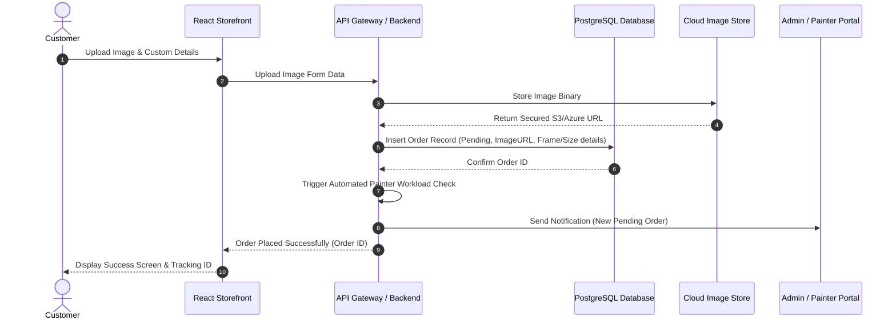
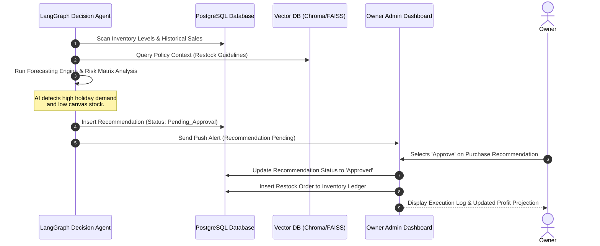
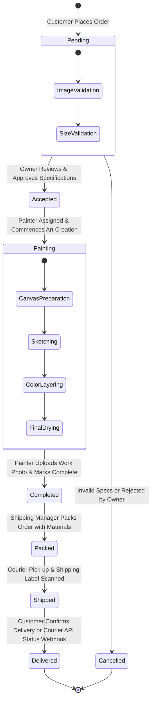
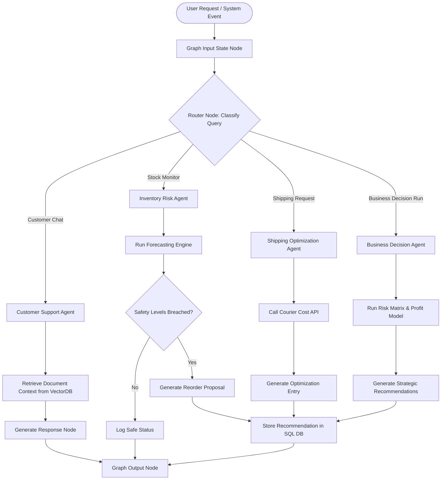
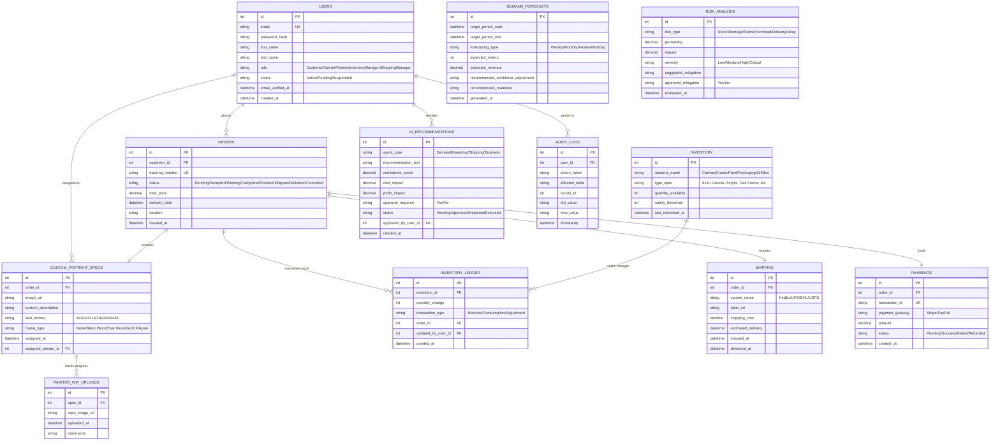
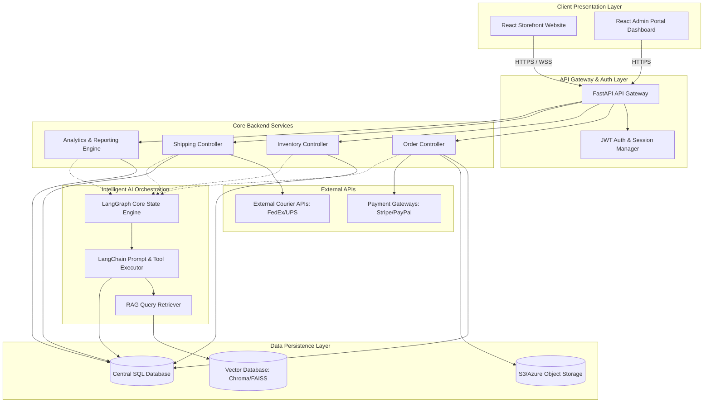
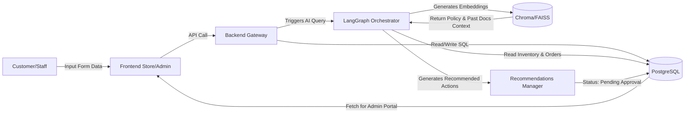

<!-- SECTION START: Business Objectives -->
## 4. Business Objectives

### 4.1 Business Model & Operational Scale
WingsArtz is a boutique handmade art and gift store offering:
1. **Ready-made Handmade Gift Products:** (e.g., customized resin art, creative cards, gift box hampers).
2. **Custom Portrait Paintings:** High-value bespoke oil/acrylic/watercolor portrait paintings requested by uploading reference photos and describing artistic requirements.

Operational flow centers on high-quality craft production, optimized inventory levels, fast and safe shipping, and automated demand/risk-aware forecasting.

### 4.2 Strategic and Financial Targets
* **Inventory Control:** Reduce material wastage by 20% through AI-guided reordering recommendations.
* **Turnaround Efficiency:** Ensure standard portrait painting orders are completed within 7 to 10 working days by scheduling painters dynamically based on overload analysis.
* **Customer Loyalty:** Achieve a customer retention/repeat rate above 25% using personalized recommendations and proactive delivery tracking.
* **AI Delegation:** Automate standard customer query handling (FAQ/shipping/order status) by 80% using the RAG Customer Support agent, freeing up painter/owner manual effort.

---

<!-- SECTION END: Business Objectives -->


<!-- SECTION START: Functional Requirements -->
## 5. Functional Requirements

### 5.1 System-Wide Functional List
The WingsArtz platform must implement the following key functional capabilities:
1. **User Authentication & Session Management:** SEC-AUTH-001 through SEC-AUTH-006.
2. **Dynamic Product Catalog:** Catalog browsing, detailed description, and search/filtering.
3. **Bespoke Custom Portrait Order Pipeline:** Image upload, frame, canvas sizing, and text description submission.
4. **Interactive Checkout & Payment Processing:** Safe transaction routing.
5. **Real-time Order Status & Tracking:** Live progress updating for customers and shipping tracker.
6. **AI Agent Workflows (LangGraph):** Automating stock monitoring, courier cost search, business recommendation loops.
7. **Vector Database RAG Engine:** Embedding and querying historical reviews, policies, and products.
8. **Painter Task Queue:** View assigned paintings, download image assets, upload WIP / finished paintings, and mark completion.
9. **Inventory & Shipping Dashboards:** Stock history, forecasting, courier price matching, and reorder approvals.
10. **Owner Command Dashboard:** Single-point business KPI visualization, risk alerts, and decision approval portal.

### 5.2 Module Epics & Requirements Mapping
* **Epic 1: Authentication & Authorization (Auth Module)**
  * *REQ-AUTH-001:* Secure email-based registration and verification.
  * *REQ-AUTH-002:* JWT-based session allocation with role scopes (`Customer`, `Owner`, `Painter`, `InventoryManager`, `ShippingManager`).
* **Epic 2: Personalized Ordering (Customer Storefront)**
  * *REQ-CUST-001:* User profile management and order history tracking.
  * *REQ-CUST-002:* Custom portrait image uploader (restricting MIME type and size to 5MB, stored on secure bucket with URLs saved in SQL).
* **Epic 3: AI Orchestration (Agentic & RAG Modules)**
  * *REQ-AI-001:* Autonomous weekly demand, material, and labor planning.
  * *REQ-AI-002:* Vector search on WingsArtz business policies and past reviews to assist user support queries.

---

<!-- SECTION END: Functional Requirements -->


<!-- SECTION START: Non-Functional Requirements -->
## 6. Non-Functional Requirements

### 6.1 Performance and Response Times
* **Page Load Time:** Home and gallery page loading must complete within 2.0 seconds under standard broadband conditions.
* **API Latency:** Normal read/write endpoints must respond in less than 300ms under a load of 100 concurrent requests.
* **LLM / Agent Response Latency:** The customer support chatbot must generate the first token of the RAG response within 1.5 seconds, and complete execution in under 5.0 seconds.
* **Bulk Recommendations Run:** AI batch forecasting and risk analyses must run asynchronously in background tasks, completing in under 15 seconds.

### 6.2 Availability and Reliability
* **System Uptime:** The platform must maintain a 99.9% monthly availability rate, excluding planned maintenance windows.
* **Database Backups:** Automatic daily incremental backups and weekly full backups of the PostgreSQL DB must be stored in isolated cloud storage.

### 6.3 Security & Encryption Standards
* **Data Transit:** All connection traffic must use TLS 1.3 (HTTPS/WSS).
* **Data at Rest:** Passwords must be hashed using bcrypt (rounds = 12). Financial data, API keys, and sensitive database configurations must be encrypted.
* **Image Access Control:** Customer-uploaded images must only be readable via signed URLs generated for authenticated `Owner` and `Painter` sessions.

### 6.4 Scalability & Portability
* **Storage Growth:** Image storage must automatically scale dynamically to support up to 500,000 active orders.
* **Database Isolation:** The Vector DB (ChromaDB/FAISS) and SQL DB (PostgreSQL) must run in containerized environments (Docker) to ease migration across cloud vendors (AWS/Azure).

---

<!-- SECTION END: Non-Functional Requirements -->


<!-- SECTION START: User Stories -->
## 7. User Stories

### 7.1 Customer User Stories
* **US-CUST-01 (Order Portrait):** As a *Customer*, I want to upload a reference photograph and specify frame options and size, so that I can order a personalized handmade painting.
  * *Acceptance Criteria:* File upload validates only jpg/jpeg/png; preview displays selected size and calculated price; form stores image path and metadata to orders table.
* **US-CUST-02 (Chat Support):** As a *Customer*, I want to chat with an AI assistant to get answers about store policies and track my order.
  * *Acceptance Criteria:* Bot displays real-time order status when provided an order ID and replies with specific policies from RAG knowledge store.

### 7.2 Painter User Stories
* **US-PAINT-01 (Work Allocation):** As a *Painter*, I want to view a list of custom portrait orders assigned to me, so that I can see the reference image and descriptive instructions.
  * *Acceptance Criteria:* Only assigned orders are listed; painter has access to download the original image asset.
* **US-PAINT-02 (Artwork Upload):** As a *Painter*, I want to upload a photo of the completed painting, so that the Owner can verify it and mark it ready to pack.
  * *Acceptance Criteria:* Painter can drag and drop a JPG of the completed painting; uploads are logged in the order's history.

### 7.3 Inventory & Shipping Manager Stories
* **US-INV-01 (Alerts & Restocking):** As an *Inventory Manager*, I want to receive low-stock alerts, so that I can restock canvas, paint, and packaging materials before a shortage occurs.
  * *Acceptance Criteria:* System marks stock below safety thresholds as 'Low'; AI lists reorder recommendations on the dashboard.
* **US-SHIP-01 (Courier Integration):** As a *Shipping Manager*, I want to view external shipping cost comparisons, so that I can select the most cost-effective and timely courier for each order.
  * *Acceptance Criteria:* External shipping API returns rate quotes; manager can print labels and update tracking numbers.

### 7.4 Owner (Admin) Stories
* **US-OWN-01 (KPI Dashboard):** As the *Owner*, I want to see a combined overview of sales, profit margins, active painters, and delivery metrics, so that I can track business performance.
  * *Acceptance Criteria:* Charts show orders and revenue grouped by day/week/month; dashboard loads under 3 seconds.
* **US-OWN-02 (Decision Approval):** As the *Owner*, I want to review and approve AI-generated business decisions (like temporary hires or stock expansion), so that I retain full control of operations.
  * *Acceptance Criteria:* Decisions table has 'Approve' and 'Reject' buttons; approved actions trigger corresponding background flows.

---

<!-- SECTION END: User Stories -->


<!-- SECTION START: Use Case Diagrams -->
## 8. Use Case Diagrams

The following Use Case Diagram illustrates the boundaries of the WingsArtz system and how the different user roles interact with system actions and AI agents:

```mermaid
leftToRightDirection
actor Customer
actor Owner
actor Painter
actor "Inventory Manager" as InvManager
actor "Shipping Manager" as ShipManager
actor "AI Agents Suite" as AIAgents

rectangle "WingsArtz System Boundaries" {
  usecase "Register & Verify Email" as UC_Register
  usecase "Place Custom Portrait Order" as UC_OrderPortrait
  usecase "View Assigned Orders & Upload Artwork" as UC_UploadArt
  usecase "Manage Stock & Restock Alerts" as UC_ManageInv
  usecase "Compare Courier Costs & Print Label" as UC_ManageShip
  usecase "Review Business KPIs & Forecasts" as UC_ReviewDashboard
  usecase "Approve High-Level AI Recommendations" as UC_ApproveDecision
  usecase "Interact with Customer Support Bot" as UC_ChatBot
}

Customer --> UC_Register
Customer --> UC_OrderPortrait
Customer --> UC_ChatBot

Painter --> UC_UploadArt

InvManager --> UC_ManageInv

ShipManager --> UC_ManageShip

Owner --> UC_ReviewDashboard
Owner --> UC_ApproveDecision
Owner --> UC_ManageInv
Owner --> UC_ManageShip
Owner --> UC_UploadArt

UC_ManageInv <-- AIAgents : "Triggers Low-Stock Alert"
UC_ManageShip <-- AIAgents : "Provides Courier Pricing"
UC_ApproveDecision <-- AIAgents : "Submits Scaling/Hiring Recommendations"
UC_ChatBot <-- AIAgents : "RAG Query Answering"
```

---

<!-- SECTION END: Use Case Diagrams -->


<!-- SECTION START: Sequence Diagrams -->
## 9. Sequence Diagrams

### 9.1 Sequence Diagram: Custom Portrait Order Placement & Painter Allocation
This diagram describes the flow when a customer submits a portrait order, which is stored in the database and triggers the painter allocation check:



### 9.2 Sequence Diagram: AI Recommendation & Owner Approval Lifecycle
This diagram outlines the loop where the AI Agent detects a risk and proposes an action that must be approved by the Owner:



---

<!-- SECTION END: Sequence Diagrams -->


<!-- SECTION START: Activity Diagrams -->
## 10. Activity Diagrams

### 10.1 Activity Diagram: Order State Machine Transitions
This activity diagram tracks the workflow transitions of an order from submission through shipping and delivery, detailing validation guards:



### 10.2 Activity Diagram: LangGraph Multi-Agent Routing Flow
This diagram details how tasks are routed dynamically between different specialized agents inside LangGraph:



---

<!-- SECTION END: Activity Diagrams -->


<!-- SECTION START: ER Diagram -->
## 11. ER Diagram

This diagram displays the relational database schema of WingsArtz, including standard relational tables and AI tracking tables:



---

<!-- SECTION END: ER Diagram -->


<!-- SECTION START: System Architecture -->
## 12. System Architecture

The WingsArtz system follows a modular, cloud-native architecture split into decoupled frontend applications, a microservices-capable API backend, and an intelligent Agentic AI/RAG orchestration core.

### 12.1 High-Level Block Diagram & Component Layout
Below is the High-Level System Architecture and Component Layout:



### 12.2 Data Flow Diagram (DFD Level 1)
This diagram models the lifecycle of user actions, data transformation, vector retrieval, and output dispatch:



### 12.3 Deployment Architecture
WingsArtz deployment utilizes containerized Docker services orchestrated on high-availability infrastructures:
* **Static Hosting:** Frontend applications (React storefront and admin portal) are built as static assets and hosted via CDN networks (AWS CloudFront / Netlify) for sub-second global delivery.
* **Application API Hosting:** The FastAPI backend is deployed on container services (AWS ECS / Azure Container Apps) with an Auto-Scaling Group triggering new nodes if CPU load exceeds 70%.
* **Database Layer:** 
  * *Relational DB:* Managed PostgreSQL instance (AWS RDS) with Multi-AZ replication.
  * *Vector DB:* Standalone ChromaDB service running in a container, loaded with a persistent block storage volume.
  * *Object Storage:* AWS S3 bucket configured with strict security policies; images are delivered to frontends through time-limited pre-signed URLs.

---

<!-- SECTION END: System Architecture -->


<!-- SECTION START: AI Architecture -->
## 13. AI Architecture

The intelligence of WingsArtz is driven by LangGraph and LangChain, enabling autonomous decision loops and conversational context retrieval (RAG).

### 13.1 Agentic AI Design with LangGraph
Rather than utilizing basic linear LLM prompting, WingsArtz relies on a cyclic, stateful multi-agent system.
* **LangGraph State Graph:** The system maintains a shared `GraphState` that stores the current user input, active database metrics, active risk flags, list of generated recommendations, and conversation history.
* **Specialized Autonomous Agents (Nodes):**
  1. **Demand Prediction Agent:** Evaluates past sales counts, identifies seasonality, and projects orders.
  2. **Inventory Risk Agent:** Evaluates raw stock levels, checks safety thresholds, and alerts of shortages.
  3. **Shipping Optimization Agent:** Queries shipping rate APIs, evaluates courier timelines, and checks delivery delay probabilities.
  4. **Business Decision Agent:** Pulls reports on revenue and worker workloads, proposing scaling, temp painter hires, or pricing promotions.
  5. **Customer Support Agent:** Reads user chatbot messages, queries the Vector DB for answers, and checks live order status from the SQL DB.
* **Conditional Routing (Edges):** Code-based routing logic determines which agent executes next based on state data. For example, if a "reorder canvas" recommendation is proposed, control routes to the Risk Agent to evaluate financial constraints before final database storage.

### 13.2 RAG (Retrieval-Augmented Generation) Design
To ensure AI recommendations and chatbot answers match WingsArtz business realities, a dense RAG pipeline is implemented:
* **Knowledge Ingestion:** Business policies (e.g., refund policies, framing turnaround limits, shipping terms), historical customer reviews, preset catalog details, and historical courier performance logs are split into chunks using LangChain's `RecursiveCharacterTextSplitter` (chunk size = 500, overlap = 50).
* **Vector Vector Store:** Chunks are vectorized using OpenAI `text-embedding-3-small` embeddings and indexed inside a persistent ChromaDB instance.
* **Query Flow:** When a user chats or an agent needs parameters:
  1. Query is embedded.
  2. Similarity search runs on ChromaDB ($k = 3$).
  3. Retrieved documents are passed inside the LLM prompt as context variables, constraining the model's text generation to truth-validated facts.

### 13.3 SQL & Vector DB Interfaces
* **SQL Query Interface (PostgreSQL):** Agents are equipped with structured LangChain tools (e.g., `get_inventory_levels`, `get_active_painter_workload`, `insert_ai_recommendation`). Direct SQL generation is forbidden to prevent SQL injection risks; agents only invoke predefined Python functions with strongly-typed arguments.
* **Vector Interface (ChromaDB):** Agents invoke the `query_business_knowledge` tool which interfaces with ChromaDB client, retrieves raw text, and structures the source citation details.

---

<!-- SECTION END: AI Architecture -->


<!-- SECTION START: Database Design -->
## 14. Database Design

The WingsArtz SQL database runs on PostgreSQL. The database design utilizes strict constraints, data-integrity foreign keys, and performant indexes.

### 14.1 PostgreSQL Schema Definition (Tables & Columns)

#### 1. `users` Table
Stores authentication and role-based profiles.
* `id`: `SERIAL PRIMARY KEY`
* `email`: `VARCHAR(255) NOT NULL UNIQUE` (Validated email format)
* `password_hash`: `VARCHAR(255) NOT NULL` (Bcrypt hash)
* `first_name`: `VARCHAR(100) NOT NULL`
* `last_name`: `VARCHAR(100) NOT NULL`
* `role`: `VARCHAR(50) NOT NULL CHECK (role IN ('Customer', 'Owner', 'Painter', 'InventoryManager', 'ShippingManager'))`
* `status`: `VARCHAR(50) NOT NULL DEFAULT 'Active' CHECK (status IN ('Active', 'Pending', 'Suspended'))`
* `email_verified_at`: `TIMESTAMP WITH TIME ZONE`
* `created_at`: `TIMESTAMP WITH TIME ZONE DEFAULT CURRENT_TIMESTAMP`

#### 2. `orders` Table
Tracks customer orders and their current status in the pipeline.
* `id`: `SERIAL PRIMARY KEY`
* `customer_id`: `INT NOT NULL REFERENCES users(id) ON DELETE RESTRICT`
* `tracking_number`: `VARCHAR(100) NOT NULL UNIQUE` (Internal system code, e.g. WA-YYYYMMDD-XXXX)
* `status`: `VARCHAR(50) NOT NULL DEFAULT 'Pending' CHECK (status IN ('Pending', 'Accepted', 'Painting', 'Completed', 'Packed', 'Shipped', 'Delivered', 'Cancelled'))`
* `total_price`: `NUMERIC(10, 2) NOT NULL CHECK (total_price >= 0)`
* `delivery_date`: `TIMESTAMP WITH TIME ZONE NOT NULL`
* `location`: `VARCHAR(255) NOT NULL` (Stores customer shipping address or GPS coordinates)
* `created_at`: `TIMESTAMP WITH TIME ZONE DEFAULT CURRENT_TIMESTAMP`

#### 3. `custom_portrait_specs` Table
Stores custom image URLs, text descriptions, and frames for ordered paintings.
* `id`: `SERIAL PRIMARY KEY`
* `order_id`: `INT NOT NULL UNIQUE REFERENCES orders(id) ON DELETE CASCADE`
* `image_url`: `VARCHAR(2083) NOT NULL` (Secure pre-signed URL)
* `custom_description`: `TEXT NOT NULL`
* `size_inches`: `VARCHAR(50) NOT NULL CHECK (size_inches IN ('8x10', '11x14', '16x20', '24x36'))`
* `frame_type`: `VARCHAR(100) NOT NULL CHECK (frame_type IN ('None', 'Black Wood', 'Oak Wood', 'Gold Filigree'))`
* `assigned_painter_id`: `INT REFERENCES users(id) ON DELETE SET NULL`
* `assigned_at`: `TIMESTAMP WITH TIME ZONE`

#### 4. `painter_wip_uploads` Table
Tracks WIP images uploaded by painters to prove progress.
* `id`: `SERIAL PRIMARY KEY`
* `spec_id`: `INT NOT NULL REFERENCES custom_portrait_specs(id) ON DELETE CASCADE`
* `wips_image_url`: `VARCHAR(2083) NOT NULL`
* `comments`: `TEXT`
* `uploaded_at`: `TIMESTAMP WITH TIME ZONE DEFAULT CURRENT_TIMESTAMP`

#### 5. `inventory` Table
Stores available quantities of materials.
* `id`: `SERIAL PRIMARY KEY`
* `material_name`: `VARCHAR(100) NOT NULL` (e.g. 'Canvas', 'Frame', 'Paint', 'Packaging', 'GiftBox')
* `type_spec`: `VARCHAR(100) NOT NULL` (e.g. '16x20 Canvas', 'Titanium White Paint', 'Oak Wood 16x20 Frame')
* `quantity_available`: `INT NOT NULL CHECK (quantity_available >= 0)`
* `safety_threshold`: `INT NOT NULL CHECK (safety_threshold >= 0)` (Alert triggers if quantity goes below this)
* `last_restocked_at`: `TIMESTAMP WITH TIME ZONE`

#### 6. `inventory_ledger` Table
Audits stock additions and consumptions.
* `id`: `SERIAL PRIMARY KEY`
* `inventory_id`: `INT NOT NULL REFERENCES inventory(id) ON DELETE RESTRICT`
* `quantity_change`: `INT NOT NULL` (Negative for consumption, positive for restock)
* `transaction_type`: `VARCHAR(50) NOT NULL CHECK (transaction_type IN ('Restock', 'Consumption', 'Adjustment'))`
* `order_id`: `INT REFERENCES orders(id) ON DELETE SET NULL`
* `updated_by_user_id`: `INT NOT NULL REFERENCES users(id) ON DELETE RESTRICT`
* `created_at`: `TIMESTAMP WITH TIME ZONE DEFAULT CURRENT_TIMESTAMP`

#### 7. `shipping` Table
Manages shipment couriers, costs, and statuses.
* `id`: `SERIAL PRIMARY KEY`
* `order_id`: `INT NOT NULL UNIQUE REFERENCES orders(id) ON DELETE CASCADE`
* `courier_name`: `VARCHAR(100) NOT NULL`
* `label_url`: `VARCHAR(2083) NOT NULL`
* `shipping_cost`: `NUMERIC(10, 2) NOT NULL CHECK (shipping_cost >= 0)`
* `estimated_delivery`: `TIMESTAMP WITH TIME ZONE NOT NULL`
* `shipped_at`: `TIMESTAMP WITH TIME ZONE`
* `delivered_at`: `TIMESTAMP WITH TIME ZONE`

#### 8. `payments` Table
Tracks monetary transactions.
* `id`: `SERIAL PRIMARY KEY`
* `order_id`: `INT NOT NULL UNIQUE REFERENCES orders(id) ON DELETE CASCADE`
* `transaction_id`: `VARCHAR(255) NOT NULL UNIQUE`
* `payment_gateway`: `VARCHAR(50) NOT NULL CHECK (payment_gateway IN ('Stripe', 'PayPal'))`
* `amount`: `NUMERIC(10, 2) NOT NULL CHECK (amount > 0)`
* `status`: `VARCHAR(50) NOT NULL CHECK (status IN ('Pending', 'Success', 'Failed', 'Refunded'))`
* `created_at`: `TIMESTAMP WITH TIME ZONE DEFAULT CURRENT_TIMESTAMP`

#### 9. `ai_recommendations` Table
Tracks the output of the Business, Inventory, and Shipping Agents.
* `id`: `SERIAL PRIMARY KEY`
* `agent_type`: `VARCHAR(50) NOT NULL CHECK (agent_type IN ('Demand', 'Inventory', 'Shipping', 'Business'))`
* `recommendation_text`: `TEXT NOT NULL`
* `confidence_score`: `NUMERIC(3, 2) NOT NULL CHECK (confidence_score BETWEEN 0.00 AND 1.00)`
* `cost_impact`: `NUMERIC(10, 2) NOT NULL`
* `profit_impact`: `NUMERIC(10, 2) NOT NULL`
* `approval_required`: `BOOLEAN NOT NULL DEFAULT TRUE`
* `status`: `VARCHAR(50) NOT NULL DEFAULT 'Pending' CHECK (status IN ('Pending', 'Approved', 'Rejected', 'Executed'))`
* `approved_by_user_id`: `INT REFERENCES users(id) ON DELETE SET NULL`
* `created_at`: `TIMESTAMP WITH TIME ZONE DEFAULT CURRENT_TIMESTAMP`

#### 10. `demand_forecasts` Table
Tracks seasonal and festival sales projections.
* `id`: `SERIAL PRIMARY KEY`
* `target_period_start`: `TIMESTAMP WITH TIME ZONE NOT NULL`
* `target_period_end`: `TIMESTAMP WITH TIME ZONE NOT NULL`
* `forecasting_type`: `VARCHAR(50) NOT NULL CHECK (forecasting_type IN ('Weekly', 'Monthly', 'Festival', 'Holiday'))`
* `expected_orders`: `INT NOT NULL CHECK (expected_orders >= 0)`
* `expected_revenue`: `NUMERIC(10, 2) NOT NULL CHECK (expected_revenue >= 0)`
* `recommended_workforce_adjustment`: `VARCHAR(255)`
* `recommended_materials`: `TEXT`
* `generated_at`: `TIMESTAMP WITH TIME ZONE DEFAULT CURRENT_TIMESTAMP`

#### 11. `risk_analysis` Table
Stores evaluated business risk details.
* `id`: `SERIAL PRIMARY KEY`
* `risk_type`: `VARCHAR(100) NOT NULL`
* `probability`: `NUMERIC(3, 2) NOT NULL CHECK (probability BETWEEN 0.00 AND 1.00)`
* `impact`: `NUMERIC(3, 2) NOT NULL CHECK (impact BETWEEN 0.00 AND 1.00)`
* `severity`: `VARCHAR(50) NOT NULL CHECK (severity IN ('Low', 'Medium', 'High', 'Critical'))`
* `suggested_mitigation`: `TEXT NOT NULL`
* `approved_mitigation`: `BOOLEAN NOT NULL DEFAULT FALSE`
* `evaluated_at`: `TIMESTAMP WITH TIME ZONE DEFAULT CURRENT_TIMESTAMP`

#### 12. `audit_logs` Table
A full system audit log for accountability.
* `id`: `SERIAL PRIMARY KEY`
* `user_id`: `INT REFERENCES users(id) ON DELETE SET NULL`
* `action_taken`: `VARCHAR(255) NOT NULL`
* `affected_table`: `VARCHAR(100) NOT NULL`
* `record_id`: `INT`
* `old_value`: `TEXT`
* `new_value`: `TEXT`
* `timestamp`: `TIMESTAMP WITH TIME ZONE DEFAULT CURRENT_TIMESTAMP`

### 14.2 Relational Database Indexes
To maintain responsive dashboards, the following indexes are applied:
* `CREATE INDEX idx_orders_status ON orders(status);`
* `CREATE INDEX idx_orders_customer ON orders(customer_id);`
* `CREATE INDEX idx_portrait_assigned ON custom_portrait_specs(assigned_painter_id);`
* `CREATE INDEX idx_inventory_status ON inventory(quantity_available, safety_threshold);`
* `CREATE INDEX idx_recs_status ON ai_recommendations(status, agent_type);`
* `CREATE INDEX idx_audit_user_time ON audit_logs(user_id, timestamp DESC);`

---

<!-- SECTION END: Database Design -->


<!-- SECTION START: API Design -->
## 15. API Design

The WingsArtz backend exposes a RESTful API documented using OpenAPI 3.0 standards. All administrative endpoints require a valid Bearer JWT.

```yaml
openapi: 3.0.3
info:
  title: WingsArtz Core API
  version: 1.0.0
  description: API endpoints for Order, Inventory, Shipping, and AI Recommendation workflows.
paths:
  /api/v1/auth/login:
    post:
      summary: User authentication
      requestBody:
        required: true
        content:
          application/json:
            schema:
              type: object
              required: [email, password]
              properties:
                email: { type: string, format: email }
                password: { type: string, format: password }
      responses:
        '200':
          description: Login successful
          content:
            application/json:
              schema:
                type: object
                properties:
                  access_token: { type: string }
                  token_type: { type: string, example: Bearer }
                  role: { type: string, example: Owner }
        '401':
          description: Invalid email or password

  /api/v1/orders/custom:
    post:
      summary: Customer places custom portrait order
      security: [{ BearerAuth: [] }]
      requestBody:
        required: true
        content:
          multipart/form-data:
            schema:
              type: object
              required: [image, description, size_inches, frame_type, delivery_date, location]
              properties:
                image: { type: string, format: binary, description: Portrait reference photo }
                description: { type: string, example: "Paint my dog sitting under a tree" }
                size_inches: { type: string, enum: [8x10, 11x14, 16x20, 24x36] }
                frame_type: { type: string, enum: [None, Black Wood, Oak Wood, Gold Filigree] }
                delivery_date: { type: string, format: date-time }
                location: { type: string, example: "Anna Nagar, Chennai, Tamil Nadu" }
      responses:
        '201':
          description: Order placed successfully
          content:
            application/json:
              schema:
                type: object
                properties:
                  order_id: { type: integer }
                  tracking_number: { type: string }
                  total_price: { type: number }

  /api/v1/orders/{order_id}/progress:
    get:
      summary: Get detailed progress status of an order
      parameters:
        - name: order_id
          in: path
          required: true
          schema: { type: integer }
      responses:
        '200':
          description: Order tracking details
          content:
            application/json:
              schema:
                type: object
                properties:
                  order_id: { type: integer }
                  status: { type: string, example: Painting }
                  assigned_painter: { type: string, example: "John Doe" }
                  wip_uploads:
                    type: array
                    items:
                      type: object
                      properties:
                        wip_url: { type: string }
                        uploaded_at: { type: string, format: date-time }

  /api/v1/inventory/alerts:
    get:
      summary: Fetch low-stock materials and forecasted shortages
      security: [{ BearerAuth: [] }]
      responses:
        '200':
          description: List of inventory alerts
          content:
            application/json:
              schema:
                type: array
                items:
                  type: object
                  properties:
                    material_id: { type: integer }
                    material_name: { type: string }
                    quantity_available: { type: integer }
                    safety_threshold: { type: integer }
                    alert_status: { type: string, example: Low_Stock }

  /api/v1/admin/recommendations/{rec_id}/approve:
    post:
      summary: Approve an AI recommendation (Owner Only)
      security: [{ BearerAuth: [] }]
      parameters:
        - name: rec_id
          in: path
          required: true
          schema: { type: integer }
      responses:
        '200':
          description: Recommendation approved and execution queued
          content:
            application/json:
              schema:
                type: object
                properties:
                  rec_id: { type: integer }
                  status: { type: string, example: Approved }
                  executed_action: { type: string }
        '403':
          description: Access denied (non-owner role)

components:
  securitySchemes:
    BearerAuth:
      type: http
      scheme: bearer
      bearerFormat: JWT
```

---

<!-- SECTION END: API Design -->


<!-- SECTION START: UI Wireframes (textual) -->
## 16. UI Wireframes (Textual)

To achieve a premium, warm creative brand feel matching the logo's color palette (Vibrant Rose `#F68ACD`, Soft Cream `#FFF5FA`, Charcoal `#2D2529`, Gold `#E5A93B`), the UI layout is modeled after Etsy and Pinterest.

### 16.1 Customer Storefront: Home Page Layout
```
+---------------------------------------------------------------------------------+
| [Logo: WingsArtz]  Home  About  Gallery  Custom Portrait  Gifts  Track  [Cart]  |
+---------------------------------------------------------------------------------+
|                                                                                 |
|                   WELCOME TO WINGSARTZ - HANDMADE MEMORIES                      |
|      A premium boutique store for customized paintings & creative gifts.        |
|                                                                                 |
|       +----------------------------+    +-----------------------------+         |
|       | Order Custom Portrait [>]  |    | Shop Gift Collections  [>]  |         |
|       +----------------------------+    +-----------------------------+         |
|                                                                                 |
+---------------------------------------------------------------------------------+
|                       TRENDING CREATIVE CRAFTS GALLERY                          |
|  (Pinterest-style asymmetric grid layout with soft-shadow cards, rounded corners)|
|  +------------------+  +------------------+  +------------------+               |
|  | [Image: Resin]   |  | [Image: Oil]     |  | [Image: Card]    |               |
|  | Ocean Resin Tray |  | Couple Portrait  |  | Creative Pop-up  |               |
|  | ₹3,999           |  | ₹14,500          |  | ₹1,200.99           |               |
|  +------------------+  +------------------+  +------------------+               |
+---------------------------------------------------------------------------------+
| [AI Chat Help Button (Floating in bottom-right corner with pink glow)]         |
+---------------------------------------------------------------------------------+
```

### 16.2 Customer Storefront: Custom Portrait Order Page
```
+---------------------------------------------------------------------------------+
| [Logo] Custom Portrait Order Page                                       [Cart]  |
+---------------------------------------------------------------------------------+
|                                                                                 |
|  STEP 1: UPLOAD REFERENCE PHOTO       STEP 2: PORTRAIT SPECIFICATIONS           |
|  +-------------------------------+   +---------------------------------------+  |
|  |                               |   | Size: [ 16" x 20" (Standard)       v] |  |
|  |      [Drag & Drop Image Here] |   |                                       |  |
|  |                               |   | Frame: [ Oak Wood Frame (Premium)  v] |  |
|  |      (Supports JPG, PNG max   |   |                                       |  |
|  |       5MB file validation)    |   | Delivery Date: [ 07/20/2026        v] |  |
|  |                               |   +---------------------------------------+  |
|  +-------------------------------+   STEP 3: CUSTOMIZATION INSTRUCTIONS       |
|                                      | [ Please draw the background with a ] |  |
|                                      | [ soft golden sunset filter...      ] |  |
+---------------------------------------------------------------------------------+
|  STEP 4: LIVE RENDER & PRICE PREVIEW                                            |
|  +---------------------------------------------------------------------------+  |
|  | Estimated Completion: July 20, 2026 (On Schedule)                         |  |
|  | Base Price (₹10,000.00) + Frame (₹2,500.00) = Total Price: ₹1,2000.00                 |  |
|  | [ SUBMIT ORDER & PAY ] (Secure checkout via Stripe/PayPal)                |  |
|  +---------------------------------------------------------------------------+  |
+---------------------------------------------------------------------------------+
```

---

<!-- SECTION END: UI Wireframes (textual) -->


<!-- SECTION START: Dashboard Layouts -->
## 17. Dashboard Layouts

The admin portal is completely isolated from the storefront. Each dashboard features role-based layouts, clean cards, and micro-interactions.

### 17.1 Owner (Admin) Dashboard
```
+---------------------------------------------------------------------------------+
| [Logo] Owner Command Center                          [Notifications: 3] [Logout]|
+---------------------------------------------------------------------------------+
| Navigation:  [Overview]  [Approvals]  [Analytics]  [Risks]  [Team Performance]   |
+---------------------------------------------------------------------------------+
| KEY KPI CARDS (Soft shadows, rounded card containers):                          |
| +-------------------+ +-------------------+ +-------------------+ +--------------+ |
| | Total Orders: 142 | | Total Revenue     | | Net Profit:       | | Active       | |
| | (+12% this week)  | | ₹18,45,000        | | ₹7,38,000 (40%)   | | Painters: 4  | |
| +-------------------+ +-------------------+ +-------------------+ +--------------+ |
+---------------------------------------------------------------------------------+
| AI AGENT APPROVAL WORKFLOW PANELS:                                              |
| +-----------------------------------------------------------------------------+ |
| | RECOMMENDATION PROPOSAL (confidence: 94%)                                    | |
| | "Demand Agent predicts Christmas rush (+45% orders starting Nov 15).        | |
| | Propose purchase of 30x Canvas (16x20) and hiring 1 temp painter."           | |
| | Cost Impact: -₹45,000 | Profit Projection: +₹1,80,000                       | |
| | [ APPROVE RECOMMENDATION ]   [ REJECT RECOMMENDATION ]                      | |
| +-----------------------------------------------------------------------------+ |
+---------------------------------------------------------------------------------+
| SYSTEM RISK ALERT RADAR:                                                        |
| * [CRITICAL] Shipping Cost Spike: Courier routes to South Zone (Tamil Nadu/Karnataka) increased by 18%.    | |
|   Action suggested: Automatically reroute South Zone (Tamil Nadu/Karnataka) deliveries to UPS ground.     | |
| * [WARNING] Late Order Risk: Portrait Order #WA-492 has dried but not packed.    | |
+---------------------------------------------------------------------------------+
```

### 17.2 Painter Dashboard
```
+---------------------------------------------------------------------------------+
| [Logo] Painter Queue Portal                                 [Active Orders: 2]   |
+---------------------------------------------------------------------------------+
| ASSIGNED ACTIVE PAINTINGS:                                                      |
| +-----------------------------------------------------------------------------+ |
| | ORDER #WA-302 - Delivery: July 15, 2026 (Remaining: 11 days)                | |
| | Specs: 16"x20", Gold Filigree Frame | Status: [ Painting                 v] | |
| | Custom Details: "Paint the background with a soft golden sunset"            | |
| | [Download Reference Photo] | [Upload Work-in-Progress (WIP) Photo]           | |
| | WIP Upload History: wip_1.jpg (07/03/2026), wip_2.jpg (07/04/2026)           | |
| | [ SUBMIT COMPLETED ARTWORK FOR VERIFICATION ]                               | |
| +-----------------------------------------------------------------------------+ |
+---------------------------------------------------------------------------------+
```

### 17.3 Inventory Manager Dashboard
```
+---------------------------------------------------------------------------------+
| [Logo] Stock Ledger Interface                                [Low Stock: 2 Items]|
+---------------------------------------------------------------------------------+
| CURRENT STOCK STATUS:                                                           |
| +-----------------------+---------------------+-----------+-------------------+ |
| | Item Description      | Quantity Available  | Threshold | Status            | |
| +-----------------------+---------------------+-----------+-------------------+ |
| | 16x20 Cotton Canvas   | 4 units             | 10 units  | [LOW STOCK ALERT] | |
| | Oak Frames 16x20      | 3 units             | 5 units   | [LOW STOCK ALERT] | |
| | Ultramarine Blue 75ml | 18 units            | 10 units  | Normal            | |
| +-----------------------+---------------------+-----------+-------------------+ |
| AI STOCK DEMAND FORECAST FOR NEXT 30 DAYS:                                      |
| * Forecasted Consumption: 15 Canvas (16x20), 8 Oak Frames.                      |
| * Reorder Suggestion: Order 25 Canvas and 12 Oak Frames by July 10.             |
|   [Submit Purchase Request for Owner Approval]                                  |
+---------------------------------------------------------------------------------+
```

### 17.4 Shipping Manager Dashboard
```
+---------------------------------------------------------------------------------+
| [Logo] Fulfillment Portal                              [Ready to Pack/Ship: 5]  |
+---------------------------------------------------------------------------------+
| PACKING & SHIPMENT QUEUE:                                                        |
| +-----------------------------------------------------------------------------+ |
| | ORDER #WA-302 - Customer Address: Anna Nagar, Chennai, Tamil Nadu                  | |
| | Weight: 4.2 lbs | Package Box Size: Medium Craft Box                        | |
| | COURIER PRICE COMPARISON API (Live Lookup):                                 | |
| | [x] Delhivery Express  - Cost: ₹350 (Est: 3 days)                              | |
| | [ ] Blue Dart    - Cost: ₹450 (Est: 2 days)                              | |
| | [ ] DTDC Air   - Cost: ₹950 (Est: 1 day)                               | |
| | [ GENERATE SHIPPING LABEL & SHIP ] (Prints tracking details automatically)   | |
| +-----------------------------------------------------------------------------+ |
+---------------------------------------------------------------------------------+
```

---

<!-- SECTION END: Dashboard Layouts -->


<!-- SECTION START: Navigation Flow -->
## 18. Navigation Flow

The WingsArtz routing structure isolates the public e-commerce routes from administrative control views.

### 18.1 Customer Website Route Tree
* `/` - Storefront landing page, hero banner, recent reviews, links to custom portrait and collections.
* `/about` - Story of WingsArtz, details of handmade craft process, materials used.
* `/gallery` - Asymmetric photo wall of past portraits and preset gift listings.
* `/portrait-order` - Portrait design canvas uploader, frame selectors, price calculator, date check.
* `/track` - Order status lookup input field.
* `/track/{tracking_number}` - Status tracking map, WIP photos, and chatbot interface.
* `/checkout` - Customer invoice, shipping address form, Stripe form.
* `/profile` - Customer account configurations and history.

### 18.2 Admin Portal Route Tree (Authenticated Roles Only)
* `/admin/login` - Secure credentials entry with multi-factor option.
* `/admin/dashboard` - Route redirected to specialized view based on JWT claims role:
  * `/admin/owner` - Complete KPI, profit charts, approvals lists, risks screen.
  * `/admin/painter` - List of assigned artwork jobs, WIP uploader, completed job submission form.
  * `/admin/inventory` - Stock tables, ledger entry logs, reorder proposal launcher.
  * `/admin/shipping` - Shipment packing queue, API cost comparative selector, tracking tag update forms.

### 18.3 Route Guard Logic (Middleware)
* **Auth Guard:** All routes starting with `/admin` (except `/admin/login`) check for a valid `Authorization: Bearer <JWT>` header or session token. If missing or expired, redirect to `/admin/login`.
* **RBAC Guard:** If the JWT contains `role = 'Painter'` and the user tries to access `/admin/owner`, the route middleware halts execution, logs a security warning in `audit_logs`, and serves a `403 Forbidden` error screen.

---

<!-- SECTION END: Navigation Flow -->


<!-- SECTION START: Risk Matrix -->
## 19. Risk Matrix

WingsArtz implements a stateful Risk Prediction Module that audits 10 core business hazards.

| Risk ID | Risk Scenario | Prob | Imp | Severity | AI Mitigation Strategy | Owner Approval? |
| :--- | :--- | :--- | :--- | :--- | :--- | :--- |
| **RSK-01** | Sudden order surge | 0.40 | 0.80 | High | Predict order velocity; check if active backlog > painter capacity; automatically suggest temporary painter contract hire. | Yes |
| **RSK-02** | Too many same-day orders | 0.60 | 0.50 | Medium | Cap maximum customizable same-day delivery slots. Recommend extending standard delivery timeline parameters. | Yes |
| **RSK-03** | Inventory shortage | 0.70 | 0.90 | Critical | Trigger low-stock alert; generate purchase order. Suggest premium materials alternatives if local suppliers are dry. | Yes |
| **RSK-04** | Delayed deliveries | 0.30 | 0.70 | High | Query shipment tracking status hourly; flag packages stalled > 24 hours. Suggest changing default courier to FedEx. | Yes |
| **RSK-05** | Shipping cost spikes | 0.50 | 0.60 | Medium | Audit API quotes daily. Dynamically reroute heavy frames from express air to regional ground courier lines. | No (Auto) |
| **RSK-06** | Painter overload | 0.35 | 0.75 | High | Distribute assignments based on current WIP queues. Suggest extending order deadlines for incoming bids. | Yes |
| **RSK-07** | Holiday demand spikes | 0.85 | 0.80 | High | Analyze historical sales. Alert owner 45 days in advance to pre-purchase canvasses and packages. | Yes |
| **RSK-08** | Supplier delay | 0.20 | 0.85 | High | Detect delayed ledger check-ins; identify backup catalog vendors; prepare alternative order sheets. | Yes |
| **RSK-09** | Low profit margins | 0.30 | 0.90 | Critical | Analyze raw material price changes. Propose a 5-10% price markup on custom portraits or frame packages. | Yes |
| **RSK-10** | Late order completion | 0.45 | 0.80 | High | Send automatic SMS/email progress check-ins to painters if WIP photo isn't uploaded within 72 hours. | No (Auto) |

---

<!-- SECTION END: Risk Matrix -->


<!-- SECTION START: AI Recommendation Flow -->
## 20. AI Recommendation Flow

To protect business operations, recommendations generated by the LangGraph agents transition through a strict verification lifecycle.

### 20.1 Generation to Execution Pipeline
1. **Trigger:** A daily cron job runs the LangGraph evaluation state.
2. **Context Assembly:** RAG fetches current business guidelines, and SQL reads inventory counts, active painter workloads, and cash flow balances.
3. **Recommendation Generation:** The Business or Inventory Agent drafts a structured recommendation entry including confidence score, financial cost, projected profit, and mitigation justification.
4. **Approval Level Verification:**
   * *Low-Level Decisions:* (e.g., changing shipping routing rules if cost difference < $10) are directly set to 'Approved' and auto-executed by the system.
   * *High-Level Decisions:* (e.g., inventory bulk purchasing, scaling canvas orders, hiring contractors) are written to `ai_recommendations` table with status 'Pending' and display on the Owner's dashboard list.
5. **Decision Input:** The Owner logs in and clicks 'Approve' or 'Reject' on the portal UI.
6. **Execution Service:** If approved, a background task initiates (e.g. issues API invoice generation, triggers restock transactions in the database ledger, or updates order deadline fields).

---

<!-- SECTION END: AI Recommendation Flow -->


<!-- SECTION START: Agentic AI Workflow -->
## 21. Agentic AI Workflow

The multi-agent workflow operates as a stateful, routing StateGraph inside LangGraph.

```
                  +-----------------------+
                  |  Trigger Event / UI   |
                  +-----------+-----------+
                              |
                              v
                  +-----------+-----------+
                  |  Graph State Initiated|
                  +-----------+-----------+
                              |
                              v
                   /----------+----------\
                  /   Query Classification                  <         Router Node      >
                  \  (Classify State Data) /
                   \----------+----------/
           +------------------+------------------+------------------+
           |                  |                  |                  |
           v                  v                  v                  v
+----------+---------+ +------+------+ +---------+---------+ +------+------+
| Customer Chat Bot  | |  Inventory  | |    Shipping     | |   Business  |
|      Node          | | Risk Agent  | | Optimizer Agent | | Decision Agt|
+----------+---------+ +------+------+ +---------+---------+ +------+------+
           |                  |                  |                  |
           v                  |                  |                  |
+----------+---------+        |                  |                  |
| Query Vector Store |        |                  |                  |
|     (RAG Node)     |        |                  |                  |
+----------+---------+        |                  |                  |
           |                  |                  |                  |
           +------------------+------------------+------------------+
                              |
                              v
                  +-----------+-----------+
                  | Execute SQL / API     |
                  | Log Recommendation    |
                  +-----------+-----------+
                              |
                              v
                  +-----------+-----------+
                  |  Update Graph Output  |
                  +-----------------------+
```

### 21.1 Core Node Actions
* **Router Node:** Evaluates incoming parameters. If transaction state reports low inventory, routes execution to the Inventory Risk Agent node. If a user asks a general question, routes to the Customer Support Agent node.
* **Support Agent Node:** Combines question with similarities fetched from the vector database, formats citation references, and generates a friendly support message.
* **Risk Agent Node:** Inspects active stock balances and logs safety flags if materials count is less than the threshold.
* **Shipping Optimizer Node:** Calls external shipping cost calculators and routes orders to the lowest-cost carrier.
* **Business Decision Node:** Scans profit margins, active orders, and painter workloads to generate optimization entries in the DB.

---

<!-- SECTION END: Agentic AI Workflow -->


<!-- SECTION START: RAG Workflow -->
## 22. RAG Workflow

The RAG workflow ensures the LLM generates accurate context-aware responses rather than halluncinating business rules.

```
DATA INGESTION PHASE (Asynchronous Batch Cron):
[Business Policies PDF] + [Past Reviews CSV] + [Product Catalog]
       |
       v
[Recursive Character Text Splitter (500 char chunk, 50 overlap)]
       |
       v
[OpenAI text-embedding-3-small API]
       |
       v
[Vector Store Indexed in ChromaDB / FAISS]

RETRIEVAL & GENERATION PHASE (Runtime Chat Trigger):
[Customer Chat / Query] --> [Embed Query] --> [Similarity Search k=3]
                                                      |
                                                      v
[LLM Prompt Assembly] <---------------------- [Return Top 3 Text Chunks]
  Context: "You are WingsArtz Agent. Use only: {retrieved_chunks}"
  Query: "{user_query}"
       |
       v
[Generated Response with Citation Sources]
```

---

<!-- SECTION END: RAG Workflow -->


<!-- SECTION START: LangGraph State Flow -->
## 23. LangGraph State Flow

### 23.1 Python State Object Schema
The shared state variable passed between graph nodes is defined as follows:

```python
from typing import TypedDict, List, Dict, Any

class GraphState(TypedDict):
    # The active user's input/query
    user_query: str
    
    # Metadata about the active user session
    user_role: str
    user_id: int
    
    # Active execution parameters extracted by LLM parser
    extracted_entities: Dict[str, Any]
    
    # Retrieved document chunks from Vector DB (RAG)
    retrieved_context: List[str]
    
    # Current inventory alert states loaded from SQL
    inventory_alerts: List[Dict[str, Any]]
    
    # Active business risks identified
    active_risks: List[Dict[str, Any]]
    
    # List of generated proposals to write to database
    recommendations_list: List[Dict[str, Any]]
    
    # Final textual response payload
    final_output: str
    
    # State routing controls
    next_node: str
```

### 23.2 State Transition Logic
Nodes modify the state dictionary and specify routing logic:
1. **Initialize State:** Sets `user_query`, `user_role`, and clears lists.
2. **Execute Agent Node:** (e.g., `inventory_risk_agent`) updates `inventory_alerts` and writes proposal structures to `recommendations_list`.
3. **Execute Routing Edge:** Reads `inventory_alerts`. If list contains items where quantity is below threshold, routes execution to the `business_decision_agent` node to evaluate budget feasibility.
4. **Log State Node:** Saves data inside the PostgreSQL database and compiles the `final_output` message.

---

<!-- SECTION END: LangGraph State Flow -->


<!-- SECTION START: Module-wise Requirements -->
## 24. Module-wise Requirements

This section provides a detailed technical specification for each of the 9 core modules in WingsArtz. Each module is evaluated across the 12 mandated architectural facets.

---

### Module 1: Authentication & Authorization Module

* **1. Purpose:** To secure access to customer profiles and administrative portals, implementing Role-Based Access Control (RBAC).
* **2. Functional Requirements:** Users can sign up, log in, verify their email address, request password resets, and log out securely. Sessions are issued via JWT.
* **3. Inputs:** Email, password, first name, last name, verify token, reset token.
* **4. Outputs:** Auth status, JWT token containing role claims, redirect path, verification emails.
* **5. User Roles:** All (Customer, Owner, Painter, Inventory Manager, Shipping Manager).
* **6. Business Rules:** JWT access tokens expire in 1 hour; refresh tokens expire in 7 days. Only users with status 'Active' can authenticate. Users cannot modify their own roles.
* **7. Validation Rules:** Passwords must be at least 8 characters, containing one capital letter, one number, and one special character. Email must pass format regex verification.
* **8. Exception Handling:** On incorrect login, return generic "Invalid credentials" error to prevent email harvesting. On expired JWT, return HTTP 401 Unauthorized.
* **9. AI Involvement:** None.
* **10. Dependencies:** PostgreSQL, SendGrid/SMTP service for verification emails.
* **11. Risks:** Brute-force credentials guessing; token hijacking. Mitigation includes lockouts after 5 failed login attempts and setting the HttpOnly flag on cookies.
* **12. Acceptance Criteria:** User receives email verification link upon registration. System blocks access to `/admin` routes if a user logs in with a 'Customer' account.

---

### Module 2: Customer Storefront & Custom Portrait Order Module

* **1. Purpose:** Allows customers to browse products and place personalized orders by uploading reference photos and describing details.
* **2. Functional Requirements:** Provide gallery browsing, size and frame dropdown selectors, an image file drag-and-drop uploader, a live price calculator, and Stripe checkouts.
* **3. Inputs:** Product selection, uploaded JPG/PNG image file, text custom description, size, frame option, requested delivery date, payment parameters.
* **4. Outputs:** Generated order ID, invoice, Stripe checkout redirect URL, tracking number.
* **5. User Roles:** Customer.
* **6. Business Rules:** Pricing formula: $\text{Total Price} = \text{Base Size Price} + \text{Frame Cost}$. Custom portraits require a minimum of 7 days delivery lead time.
* **7. Validation Rules:** Uploaded image must be JPG, JPEG, or PNG format and cannot exceed 5MB. Custom descriptions must be between 10 and 1000 characters.
* **8. Exception Handling:** If file upload fails or image is corrupted, halt execution, serve error notification "Image upload failed, please try again," and clear transaction temp state.
* **9. AI Involvement:** Basic image sizing check.
* **10. Dependencies:** S3 Storage service, Stripe API, PostgreSQL.
* **11. Risks:** Malicious file execution; payment processing failures. Mitigation: S3 file renaming, strict MIME verification, Stripe webhook verification signatures.
* **12. Acceptance Criteria:** Price changes instantly when changing sizes or frames in UI. S3 URL is stored securely in SQL DB. Only Owner and Painters can access uploaded files.

---

### Module 3: Order Management Module

* **1. Purpose:** Orchestrates status transitions of orders throughout the production and dispatch phases.
* **2. Functional Requirements:** Log orders, transition statuses, trigger auto-emails on status updates, and assign painters.
* **3. Inputs:** Order status changes, painter assignment selections.
* **4. Outputs:** Status update events, client notification emails.
* **5. User Roles:** Owner (can edit all), Painter (can update progress), Shipping Manager (can update to Packed/Shipped).
* **6. Business Rules:** Valid transitions: Pending $\rightarrow$ Accepted $\rightarrow$ Painting $\rightarrow$ Completed $\rightarrow$ Packed $\rightarrow$ Shipped $\rightarrow$ Delivered. Orders can be cancelled only when in 'Pending' state.
* **7. Validation Rules:** An order cannot be moved to 'Completed' unless a finished artwork photo URL is registered in `painter_wip_uploads`.
* **8. Exception Handling:** If painter assignment fails due to concurrency conflict, rollback transaction and alert Owner that the painter is busy.
* **9. AI Involvement:** Workload check.
* **10. Dependencies:** PostgreSQL, Email service.
* **11. Risks:** Orders stalled in intermediate states. Mitigation: System monitors and alerts Owner if an order stays in 'Painting' for more than 5 days.
* **12. Acceptance Criteria:** Updating order status instantly sends email alert to customer with status and new tracking updates.

---

### Module 4: Inventory Management Module

* **1. Purpose:** Maintains records of raw materials (canvas, paints, frames, boxes) and issues alerts when stock depletes.
* **2. Functional Requirements:** Record stock updates, log ledger entries, calculate safety thresholds, and list reordering parameters.
* **3. Inputs:** Material receipt logs, consumption counts, safety limit values.
* **4. Outputs:** Low stock notifications, restock order drafts, inventory forecast lists.
* **5. User Roles:** Inventory Manager, Owner.
* **6. Business Rules:** Low-stock alert triggers instantly when `quantity_available` < `safety_threshold`. Staff cannot adjust stock logs without writing a ledger reason entry.
* **7. Validation Rules:** Material counts cannot be adjusted to negative values. Safety thresholds must be positive integers.
* **8. Exception Handling:** If restock logs contain missing data fields, reject log and display "All fields (item, count, supplier) are mandatory."
* **9. AI Involvement:** The Inventory Risk Agent audits historical consumption rates to calculate restock recommendations.
* **10. Dependencies:** PostgreSQL, AI Orchestrator service.
* **11. Risks:** Database records desyncing from actual physical counts. Mitigation: Require weekly physical audits log entries.
* **12. Acceptance Criteria:** Low-stock flags automatically display in orange on inventory manager dashboard when stock levels drop.

---

### Module 5: Shipping & Fulfillment Module

* **1. Purpose:** Handles packaging requirements, prints courier shipping labels, and tracks deliveries.
* **2. Functional Requirements:** Query shipping rates via APIs, suggest box sizes, print labels, and log courier tracking numbers.
* **3. Inputs:** Address details, parcel weights, selected carrier choice.
* **4. Outputs:** Shipping labels (PDF), API tracking URLs, freight price selections.
* **5. User Roles:** Shipping Manager, Owner.
* **6. Business Rules:** Shipping managers can only execute shipments; they cannot edit inventory lists or alter client billing data.
* **7. Validation Rules:** Destination address must be verified by the courier API. Weight inputs must be greater than zero.
* **8. Exception Handling:** If external courier API is down, automatically fallback to cached rate quotes and log warning to alerts feed.
* **9. AI Involvement:** Shipping Optimization Agent matches box dimensions and courier rates to suggest the cheapest shipping route.
* **10. Dependencies:** EasyPost / FedEx / UPS API.
* **11. Risks:** Delivery delays; lost packages. Mitigation: Automatic tracking system alerts team if a package is stagnant.
* **12. Acceptance Criteria:** Click 'Generate Label' calls external shipping cost API, prints label PDF, and updates tracking number.

---

### Module 6: Owner Dashboard Module

* **1. Purpose:** The central command center for the Owner to view metrics, identify risks, and authorize high-level AI decisions.
* **2. Functional Requirements:** Display charts (Revenue, Net Profit, Order Volumes), show risk matrix dashboards, and present approval cards.
* **3. Inputs:** Approval actions (Approve/Reject clicks).
* **4. Outputs:** Updated execution logs, chart panels, approval confirmations.
* **5. User Roles:** Owner.
* **6. Business Rules:** Access is restricted exclusively to the Owner. High-level AI proposals (like hiring temp help) require explicit Owner approval before execution.
* **8. Exception Handling:** Database connection failures must present a clean error screen with a "Retry Connection" button, keeping financial data cached securely.
* **9. AI Involvement:** Aggregates recommendations from all AI agents.
* **10. Dependencies:** PostgreSQL, Analytics Engine, LangGraph State Engine.
* **11. Risks:** Security breach of the Owner dashboard exposes all business operations. Mitigation: Force session timeouts after 15 minutes of inactivity.
* **12. Acceptance Criteria:** Approving a recommendation changes its status to 'Approved' in SQL and launches the corresponding workflow.

---

### Module 7: Painter Portal Module

* **1. Purpose:** Provides painters with a secure interface to view assigned portrait tasks and track their progress.
* **2. Functional Requirements:** Render a list of assigned portrait specs, allow downloading reference photos, and support WIP/finished image uploads.
* **3. Inputs:** Progress updates, image files (WIP/finished paintings), comments.
* **4. Outputs:** Updated WIP upload entries, status updates.
* **5. User Roles:** Painter, Owner.
* **6. Business Rules:** Painters cannot view financial dashboards, modify database inventories, or allocate orders to other painters.
* **7. Validation Rules:** Uploaded image files must be valid JPG/PNG, maximum size 5MB.
* **8. Exception Handling:** If an upload fails, keep the previously uploaded WIP list unchanged and notify user to re-attempt.
* **9. AI Involvement:** None.
* **10. Dependencies:** Cloud Storage (S3), PostgreSQL.
* **11. Risks:** Exposure of painter contact info. Mitigation: Direct database isolation of user attributes.
* **12. Acceptance Criteria:** Painter is only able to see orders explicitly assigned to them. Uploaded files display instantly in the WIP log.

---

### Module 8: Analytics & Reporting Module

* **1. Purpose:** Generates operational reports on orders, profits, and fulfillment metrics.
* **2. Functional Requirements:** Compile sales, profit margins, delivery averages, painting completion speeds, and material consumption rates.
* **3. Inputs:** Query date ranges, report filters.
* **4. Outputs:** PDF/CSV reports, interactive dashboard graphs.
* **5. User Roles:** Owner.
* **6. Business Rules:** Financial data reports can only be pulled by the Owner.
* **7. Validation Rules:** Start dates must precede end dates in date range queries.
* **8. Exception Handling:** On query timeout, return a partial cached report state and suggest a narrower date range query.
* **9. AI Involvement:** Evaluates trends to feed the Forecasting Engine.
* **10. Dependencies:** PostgreSQL.
* **11. Risks:** Slow SQL query runs during date-range aggregations. Mitigation: Pre-calculate daily summaries in a materialized view database.
* **12. Acceptance Criteria:** Exports of CSV/PDF reports complete in under 5 seconds.

---

### Module 9: AI Agent & RAG Core Module

* **1. Purpose:** Runs the LangGraph multi-agent loop and RAG querying.
* **2. Functional Requirements:** Classify queries, fetch context from Vector DB, search courier costs, run forecasting, and update GraphState.
* **3. Inputs:** Prompt query string, state variables, Vector DB context.
* **4. Outputs:** Generated chat outputs, structured business recommendation entries.
* **5. User Roles:** Customer (via support bot), Owner (via dashboard recommendations).
* **6. Business Rules:** The AI agent cannot perform financial operations or modify inventory levels without direct Owner approval.
* **7. Validation Rules:** AI outputs must pass a validation check to block malicious prompts.
* **8. Exception Handling:** If ChromaDB is unreachable, automatically route queries to basic SQL search or serve default policy statements.
* **9. AI Involvement:** Primary module core (LangGraph/LangChain/OpenAI).
* **10. Dependencies:** PostgreSQL, ChromaDB/FAISS, OpenAI API.
* **11. Risks:** LLM hallucination; API rate-limit errors. Mitigation: Strict prompt boundaries, fallback policies, and retry mechanics.
* **12. Acceptance Criteria:** RAG queries return responses with proper source document references and match store policies.

---

<!-- SECTION END: Module-wise Requirements -->


<!-- SECTION START: Page-wise Requirements -->
## 25. Page-wise Requirements

This section specifies the interface, navigation, user inputs, validation, and AI assistance for every screen in the WingsArtz platform.

---

### 25.1 Customer Website Pages

#### 1. Home Page (`/`)
* **Purpose:** Storefront landing page that establishes the premium brand identity.
* **Accessible Roles:** Public.
* **UI Components:** Hero banner, curated category cards, recent testimonials carousels, floating AI chat button.
* **Primary Actions:** "Order Custom Portrait" CTA (redirects to `/portrait-order`), "Browse Gifts" CTA (redirects to `/gallery`).
* **Validation Rules:** None.
* **AI Assistance:** Chatbot answers product availability queries.

#### 2. About WingsArtz Page (`/about`)
* **Purpose:** Explains the handmade craft process and painter bios.
* **Accessible Roles:** Public.
* **UI Components:** Text grids, material showcase image cards.
* **Primary Actions:** "Read FAQs" redirect, "View Gallery" redirect.
* **Validation Rules:** None.

#### 3. Products Gallery (`/gallery`)
* **Purpose:** Pinterest-style masonry grid showing preset gift products and custom portrait samples.
* **Accessible Roles:** Public.
* **UI Components:** Multi-category filter tabs, product image cards with hover transitions.
* **Primary Actions:** Category click, Product details modal trigger, "Add to Cart" click.
* **Validation Rules:** Filter queries must be text.

#### 4. Custom Portrait Order Page (`/portrait-order`)
* **Purpose:** Custom portrait configuration and uploader interface.
* **Accessible Roles:** Public (Requires login to submit).
* **UI Components:** Drag-and-drop file uploader, size selector dropdown, frame selector, delivery datepicker.
* **Primary Actions:** "Select Image", "Calculate Quote", "Submit Order".
* **Inputs:** Reference Image, Custom Instructions, Size selection, Frame selection, Requested Date.
* **Validation Rules:** Image must be PNG/JPG, size < 5MB. Delivery date must be at least 7 days in the future.
* **AI Assistance:** Checks if instructions contain any offensive content before submitting.

#### 5. Gift Collections Page (`/gifts`)
* **Purpose:** Focuses on pre-assembled gift boxes and custom hampers.
* **Accessible Roles:** Public.
* **UI Components:** Category cards (e.g. Resin Sets, Anniversary hampers), "Build-Your-Own-Box" grid.

#### 6. Testimonials Page (`/testimonials`)
* **Purpose:** Displays verified customer ratings and completed artwork side-by-side.
* **Accessible Roles:** Public.
* **UI Components:** Review cards showing (1) customer reference image, (2) final painting image, (3) star score, (4) review text.

#### 7. FAQs Page (`/faqs`)
* **Purpose:** Accords fast answers to common questions.
* **Accessible Roles:** Public.
* **UI Components:** Accordion dropdown menus, search bar.
* **AI Assistance:** Interactive chatbot floating icon answers queries directly by querying ChromaDB FAQs indexes.

#### 8. Contact Page (`/contact`)
* **Purpose:** Provides a manual message submission form.
* **Accessible Roles:** Public.
* **Inputs:** Name, Email, Subject, Message.
* **Validation Rules:** Email must be valid; Message length > 15 characters.

#### 9. Track Order Page (`/track` & `/track/{tracking_number}`)
* **Purpose:** Customer progress tracker.
* **Accessible Roles:** Public.
* **UI Components:** Interactive step bar (Pending, Painting, Shipped, Delivered), list of painter's WIP photo logs.
* **Primary Actions:** "Request AI Status Summary".
* **AI Assistance:** Support Agent generates a brief text describing active order delays.

#### 10. Profile Page (`/profile`)
* **Purpose:** Manage account preferences.
* **Accessible Roles:** Authenticated Customer.
* **Inputs:** Name, Phone, Address logs.

#### 11. Order History Page (`/profile/orders`)
* **Purpose:** List of past invoices.
* **Accessible Roles:** Authenticated Customer.

#### 12. Checkout Page (`/checkout`)
* **Purpose:** Final order invoice compilation.
* **Accessible Roles:** Authenticated Customer.
* **UI Components:** Invoice summary, Address auto-fill inputs, Shipping speed radio buttons.
* **Primary Actions:** "Proceed to Payment".

#### 13. Payment Page (`/checkout/payment`)
* **Purpose:** Processes financial credentials.
* **Accessible Roles:** Authenticated Customer.
* **UI Components:** Secure Stripe / PayPal card elements iframe.
* **Primary Actions:** "Pay Now".
* **Validation Rules:** Card fields verified by Stripe SDK.

---

### 25.2 Admin & Fulfillment Portal Pages

#### 1. Admin Login Page (`/admin/login`)
* **Purpose:** Secure gateway to administrative tools.
* **Accessible Roles:** Public.
* **Inputs:** Email, Password, 2FA credentials verification.
* **Validation Rules:** Fields cannot be blank.

#### 2. Owner Dashboard (`/admin/owner`)
* **Purpose:** Main command screen for the store owner.
* **Accessible Roles:** Owner.
* **UI Components:** Profit line charts, active painter list, risk status radar chart, recommendation approval cards list.
* **Primary Actions:** Click "Approve" or "Reject" on AI recommendation cards.

#### 3. Painter Dashboard (`/admin/painter`)
* **Purpose:** Workspace for the art studio team.
* **Accessible Roles:** Painter, Owner.
* **UI Components:** Assignment grids, WIP photo history lists, upload buttons.
* **Primary Actions:** "Download Customer Reference Image," "Upload WIP Photo," "Submit Completed Artwork."
* **Validation Rules:** WIP uploads must be valid image formats.

#### 4. Inventory Manager Dashboard (`/admin/inventory`)
* **Purpose:** Materials catalog control view.
* **Accessible Roles:** Inventory Manager, Owner.
* **UI Components:** Stock status data tables, ledger entry logs, forecast charts.
* **Primary Actions:** "Log Restock Transaction," "Send Purchase Proposal to Owner."
* **Validation Rules:** Quantity entries must be numeric.

#### 5. Shipping Manager Dashboard (`/admin/shipping`)
* **Purpose:** Courier dispatch execution dashboard.
* **Accessible Roles:** Shipping Manager, Owner.
* **UI Components:** Orders pending package list, courier cost side-by-side compare table, label printer controller.
* **Primary Actions:** "Get Live Shipping Quotes," "Print Label & Update Tracking."
* **Validation Rules:** Weight must be positive.

---

<!-- SECTION END: Page-wise Requirements -->


<!-- SECTION START: Acceptance Criteria -->
## 26. Acceptance Criteria

Before WingsArtz is signed off for production deployment, it must pass the following validation matrix:

### 26.1 Authentication Module
* **AC-AUTH-01:** Registering a user triggers a confirmation email. The account remains locked until the token is verified.
* **AC-AUTH-02:** Logging in returns a signed JWT containing the correct claim (e.g. `role: "Painter"`). Any attempt to access `/admin/owner` returns an HTTP 403.

### 26.2 Custom Portrait Ordering
* **AC-PORT-01:** File uploader blocks files with extensions `.exe`, `.pdf`, `.zip`, `.tiff` and limits size strictly to 5MB.
* **AC-PORT-02:** Base price matches dimensions selection exactly: `8x10` (₹6,000), `11x14` (₹8,000), `16x20` (₹10,000), `24x36` (₹14,000).
* **AC-PORT-03:** Customer-uploaded images are written to a secure cloud bucket. The SQL database only contains the secured URL path.

### 26.3 Inventory Alerting
* **AC-INV-01:** Reducing stock levels below the safety threshold instantly triggers an alert flag on the Inventory Manager UI.
* **AC-INV-02:** AI-generated restock recommendations match the safety shortages and appear in the Owner's approval queue.

### 26.4 Agentic AI Recommendation Workflow
* **AC-AI-01:** When the Owner clicks 'Approve' on an AI reorder suggestion, the system updates the recommendation record in the SQL DB, writes a ledger entry, and schedules a replenishment receipt.
* **AC-AI-02:** RAG Chatbot queries must locate policies from ChromaDB indexes and return responses including exact source citations.

---

<!-- SECTION END: Acceptance Criteria -->


<!-- SECTION START: Future Enhancements -->
## 27. Future Enhancements

The following roadmap items are planned for post-v1.0 deployment:
1. **Interactive AR Wall Preview:** Utilizing React Native / WebXR to allow customers to preview custom portrait paintings virtually on their home walls before ordering.
2. **Automated Painting Progress Time-Lapse Video:** Integrating a Raspberry Pi camera above each painter's canvas in the studio to automatically compile a time-lapse video of the painting's creation, sent to the customer upon delivery.
3. **Global Localization & Multi-Currency Support:** Support for French, German, Spanish and automated currency conversion based on IP geolocation.
4. **Subscription Crates:** Curated monthly gift crates containing art tools and materials.

---

<!-- SECTION END: Future Enhancements -->


<!-- SECTION START: SRS Extensions (July 2026) -->
## 29. SRS Extensions (July 2026)

This section specifies the authorized extensions and improvements to the WingsArtz platform architecture, workflows, and database layers, introduced in July 2026. All existing system constraints are preserved except as explicitly detailed below.

### 29.1 Admin AI Chatbot (Owner Dashboard)
* **Purpose & Value:** To empower the store Owner with a conversational interface capable of auditing sales trends, answering strategic questions, and clarifying recommendations.
* **Functional Scope:**
  - Understand dashboard analytics (e.g., "Why is today's demand predicted to be high?").
  - Explain the reasoning behind AI-generated decisions ("Why did you suggest hiring a temporary painter?").
  - Answer specific queries about inventory levels, orders, courier costs, revenue margins, and demand forecasts.
  - Suggest operational mitigation options for active business risks.
* **Architectural Integration:**
  - Uses a **Retrieval-Augmented Generation (RAG)** pipeline querying store policy documents stored in the ChromaDB vector store.
  - Equipped with custom Python database tools to fetch structured analytics from the SQLite relational DB.
  - Orchestrated via **LangChain** prompts and stateful routing nodes in **LangGraph**.
  - Configurable to call either the OpenAI API or a local LLM via environment keys.

### 29.2 Painter AI Chatbot (Painter Workspace)
* **Purpose & Scoped Access:** A dedicated assistant to help painters clarify customer customization instructions and troubleshoot painting processes.
* **Role-Based Boundaries & Restrictions:**
  - **Zero Financial Visibility:** Strictly blocked from reading revenue, pricing, courier costs, or owner strategic recommendations.
  - **No Mutative Operations:** Must not alter order statuses, assign tasks, or approve actions.
  - **Order Isolation:** Can only retrieve customization instructions, images, and details matching commissions assigned to the logged-in painter.
* **Functional Scope:**
  - Explain specific text descriptions from portrait specifications.
  - Recommend painting techniques, drying workflow optimizations, or color-blending strategies.
  - Help painters complete commissions faster while maintaining aesthetic quality.

### 29.3 Enhanced Shipping Agent & Courier Matching
* **Delhivery & Regional Integration:** The Shipping Optimization Agent is upgraded to evaluate Indian shipping realities.
* **Courier Comparison Flow:**
  - Automatically fetches the customer's location coordinates/address from the order metadata.
  - Compares rates and timelines across regional courier services (Delhivery, Blue Dart, DTDC, India Post).
  - Displays estimates of shipping costs and delivery times.
  - Recommends the optimal carrier, explaining the choice (e.g., "Delhivery recommended: Lowest cost of ₹350 with 2-day delivery compared to Blue Dart at ₹450").
* **Dashboard Integration:** Displays real-time courier quotes and optimization choices on both the **Owner (Admin) Dashboard** and the **Shipping Manager Dashboard**.

### 29.4 India-Specific Business Analytics
* **Geographical Mapping:** All generic regional representations and zones are migrated to real Indian urban hubs.
* **Analytics Indicators:**
  - **Anna Nagar, Chennai:** Example hub for high-density custom portrait commissions.
  - **Bengaluru:** Primary center for high-value revenue and resin crafts orders.
  - **Hyderabad:** Highest shipping and courier transit costs.
  - **Coimbatore:** Example zone for targeted marketing due to low regional demand.
  - Other supported cities: Madurai, Mumbai, Delhi, Pune, Kochi.
* **Visualization:** Reports, forecast maps, and dashboard listings utilize these locations.

### 29.5 Customer Geolocation Feature
* **Order Pipeline Update:** Integrating location services into the Checkout & Custom Portrait Order pipeline.
* **Geolocation Capture:**
  - **Automatic Mode:** Prompts user via browser Geolocation API (`navigator.geolocation`) to auto-fill delivery address coordinates and postal info.
  - **Manual Fallback:** Standard form text inputs if GPS coordinates are declined or unavailable.
* **Persistence & Downstream Usage:**
  - Saves the location details under a new `location` field (`VARCHAR(255)`) on the `orders` table.
  - Used for regional demand reporting, shipping carrier routing, and delivery date estimation.

### 29.6 Indian Currency (INR / ₹) Specifications
* **Core Financial Unit:** All product pricing, order totals, ledger changes, and dashboard reports are transacted and displayed in Indian Rupees (INR / ₹).
* **Reference Pricing Matrix:**
  - **8x10 Canvas:** ₹6,000
  - **11x14 Canvas:** ₹8,000
  - **16x20 Canvas:** ₹10,000 (Standard)
  - **24x36 Canvas:** ₹14,000
  - **Frame Upgrades:** None (₹0), Black Wood (₹1,200), Oak Wood (₹1,500), Gold Filigree (₹2,500).

---

<!-- SECTION END: SRS Extensions (July 2026) -->

<!-- SECTION START: Conclusion -->
## 30. Conclusion

This Software Requirements Specification and Product Design Document establishes the technical foundation for the WingsArtz Intelligent Arts and Crafts platform. By combining decoupled presentation layers with containerized databases, state-of-the-art agentic workflows, and the newly specified July 2026 AI chatbot and geolocation extensions, the system achieves reliability, auditability, and efficiency. 

The software development team is authorized to proceed directly with database schema migration and API endpoint scaffolding based on these specifications.

### Project Sign-off Block

```
--------------------------------------------
Authorized Sponsor Signature (WingsArtz Owner)
Date: July 5, 2026

--------------------------------------------
Lead Software Architect Signature
Date: July 5, 2026
```

<!-- SECTION END: Conclusion -->

